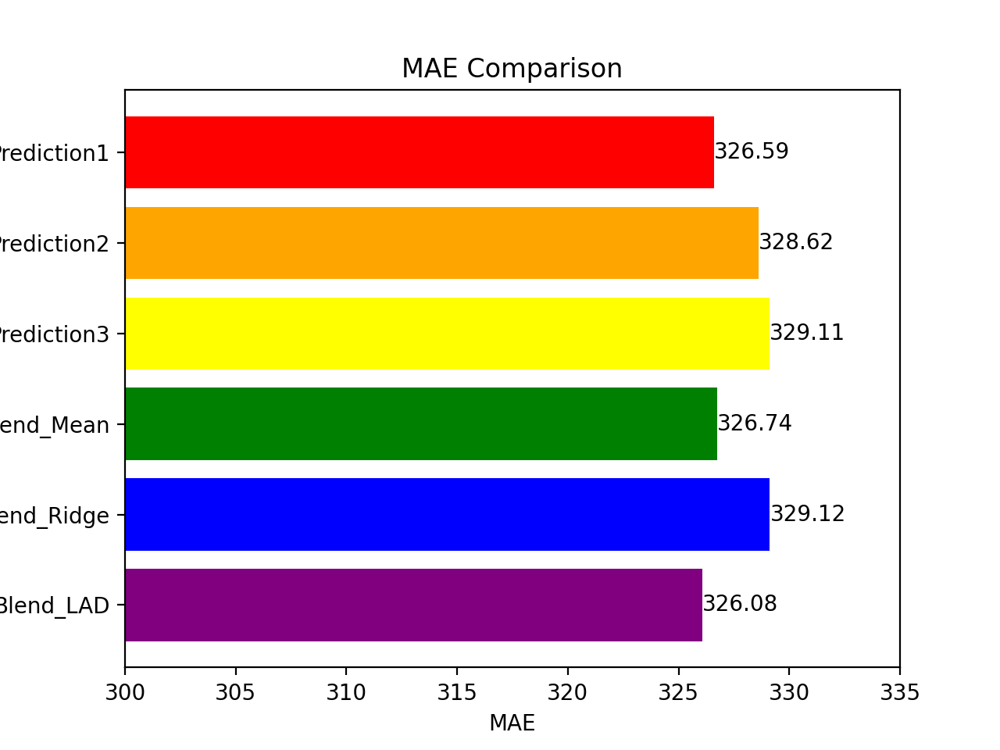

# Prediction-of-Wild-Blueberry-Yield

Prediction-of-Wild-Blueberry-Yield is one of the playground series competition that organised by Kaggle community. It always organize a variety of fairly light-weight challenges that can be used to learn and sharpen skills in different aspects of machine learning and data science.

Submissions will be evaluated using Mean Absolute Error (MAE):

where each `x_i` represents the predicted target, `y_i` represents the ground truth, and `n` is the number of rows in the test set.

The evaluation of each algorithms: 

   

`LADRegression` was chosen for the prediction of wild blueberry yield because it had the lower `MAE` value.

